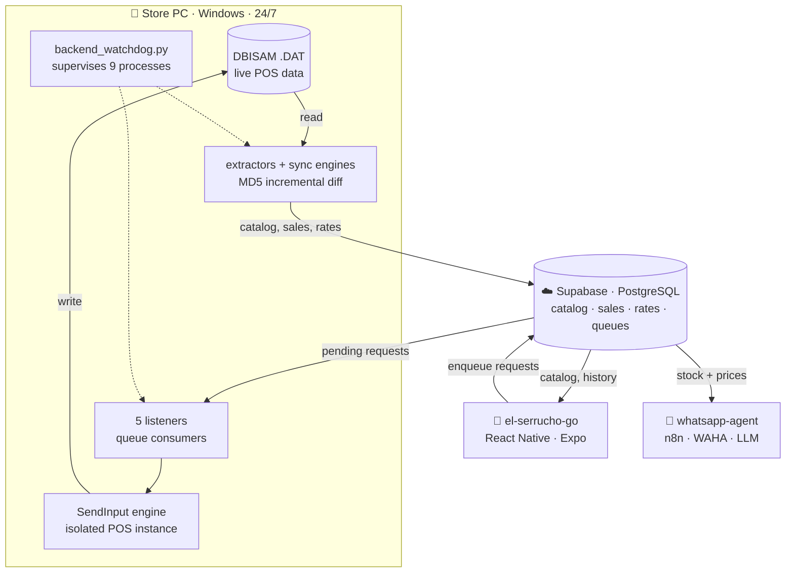

# Hybrid-on-Cloud — Bidirectional Bridge Between a Legacy POS and the Cloud

Production backend that keeps a closed, 20-year-old Delphi/DBISAM point-of-sale
system (**HybridLite**) in sync with a **Supabase/PostgreSQL** database — in both
directions. It has been running unattended, 24/7, in a working hardware store
since May 2026.

> **Read path:** DBISAM `.DAT` files → Python extractors → incremental diff →
> Supabase.
> **Write path:** cloud request queue → supervised UI automation → HybridLite.

It is the data layer for two other production apps: a mobile app the staff uses
on the floor, and an AI agent that answers customers on WhatsApp. Neither talks
to the POS — they talk to Supabase, and this backend is what makes Supabase
reflect reality.

---

## The interesting problem

The POS stores its data in **DBISAM 4** tables and exposes no API. Its ODBC
driver is a paid add-on that was not licensed, and the `.DAT` files are the live
database of a business that is open for trade — patching them directly risks
corrupting B-tree indexes, BLOB chains and checksums, and would silently destroy
the accounting ledger.

So the two directions needed different solutions:

**Reading** was tractable: the DBISAM format could be parsed read-only from
Python, streaming record by record so a 200 MB table never lands in RAM.

**Writing** was not. With no supported write path, the only remaining interface
was the application's own UI — but the usual automation route failed in a way
that took a while to characterize: driving it with `pywinauto`'s synthetic input
*appears* to work, yet the data-loading triggers quietly misbehave. The search
dialog answers `"Database name is missing"` and the grid comes back empty. The
approach that does work is emitting **real hardware-level input events through
the Win32 `SendInput` API**, which the application cannot distinguish from a
person typing — against an isolated second instance of the POS, behind a mutex
so automation never fights the cashier for the mouse.

Some of it is genuinely fiddly: price fields only accept the decimal separator
from the **numeric keypad** (`VK_DECIMAL`), ignoring the same character sent as
Unicode text.

That constraint — *the database is untouchable, so the UI is the API* — shapes
most of the design decisions below.

---

## The ecosystem

Three repositories, one shared PostgreSQL database. Supabase is the integration
bus: this backend is the only component that can reach the POS, so everything
else reads and writes rows and lets the listeners do the dangerous part.



| Repository | Role | How it connects |
| :--- | :--- | :--- |
| **Hybrid-on-Cloud** (this one) | The only component that touches the POS. Mirrors it to Supabase and applies changes back. | Owns the read and write paths. |
| [**el-serrucho-go**](https://github.com/Gus2708/el-serrucho-go) | Mobile app (React Native + Expo) the staff uses on the floor: catalog, price/stock edits, goods receipts, delivery notes, quotes. | **Reads** `productos`, `clientes`, `tazas`, sales views. **Never writes them** — it enqueues into `ordenes_cambio`, `compras_app`, `pedidos_app`, `registro_clientes_app`, which the listeners here consume and replay into the POS. |
| [**whatsapp-agent**](https://github.com/Gus2708/whatsapp-agent) | "Perucho", an AI agent answering customers on WhatsApp over 5,000+ SKUs: live stock, prices, quotes, voice notes. | **Read-only** consumer of `productos` and `tazas` — the catalog this backend keeps fresh. Runs on WAHA (Docker, port 3000); this backend health-checks that container and surfaces it in the desktop widget. |

The important property: the mobile app never writes to the catalog tables. It
writes *intent* to a queue, and the write-back listeners turn intent into real
POS documents. That keeps a single writer in front of the accounting data and
makes every change auditable — and it is why the row-level security policies
([docs/SECURITY-RLS.md](docs/SECURITY-RLS.md)) can restrict catalog writes to
`service_role` without breaking either app.

---

## What it does

**Sync to the cloud (read path)**
- Inventory, prices and stock → `productos` (prices as VAT-inclusive USD).
- Invoices and line items → `ventas` / `ventas_detalle`, converted to USD.
- Customers and suppliers → `clientes` / `proveedores`.
- Local stock adjustments mirrored to `ordenes_cambio` so the app shows one
  unified movement history per product.
- Exchange rates scraped from **BCV** and **Binance P2P** → `tazas`.
- Incremental by MD5 hash, batched at 1,000 rows, triggered by a file watcher
  with per-table debounce and cooldown.

**Write back to the POS (write path)** — five supervised queue consumers:

| Listener | Applies |
| :--- | :--- |
| `listener_writeback.py` | Stock adjustments as kardex documents, USD prices, costs, product master data |
| `listener_compras.py` | Goods receipts, including creating products that don't exist yet |
| `listener_pedidos.py` | Delivery notes (Type 10), pre-loaded so the register can charge in seconds |
| `listener_directorio.py` | New customer and supplier records with derived codes |
| `zelle_listener.py` | Bank payment notifications via Microsoft Graph, with anti-spoofing |

**Operations**
- `backend_watchdog.py` supervises **nine** processes and restarts whatever dies
  or hangs.
- Remote control without opening ports: a `comandos_remotos` table is polled, so
  a sync can be forced from outside the store.
- A desktop widget (system tray) showing sync state, rates, the BCV/Binance
  spread, drive health and the WhatsApp container's status.
- Optional webhook alerts on sync failure.

**Local HTTP API** (Flask, `app.py`)

| Method | Endpoint | Purpose |
| :--- | :--- | :--- |
| `GET` | `/api/v1/productos` | Product search over the local catalog |
| `POST` `GET` | `/api/v1/sync/inventory` | Trigger inventory sync |
| `POST` `GET` | `/api/v1/sync/sales` | Trigger sales sync |
| `POST` `GET` | `/api/v1/sync/run` | Trigger a full sync |
| `POST` `GET` | `/api/v1/sync/force` | Full resync, ignoring the hash cache |
| `GET` | `/api/v1/sync/status` | Last run, counts, lock state |
| `GET` | `/health` | Drive, Supabase, WAHA, monitor liveness |

Sync endpoints are guarded by an `X-API-Key` header when `SYNC_API_KEY` is set.

---

## Safety invariants

Automating a UI to mutate live accounting data is the risky part of this system,
so the constraints are explicit and deliberately conservative:

1. **Never write `.DAT` directly.** Every mutation goes through the POS engine so
   indexes, BLOBs and checksums stay consistent.
2. **Stock changes are documents, not updates.** Stock is adjusted by posting a
   count-adjustment document, which keeps the kardex auditable. There is no path
   that overwrites a balance.
3. **Ambiguous failures are never retried.** If a flow fails *after* the commit
   keystroke, the system cannot know whether the document was posted. Retrying
   could double a purchase or a stock delta, so the request is marked `error` for
   a human instead. Failures in clearly pre-commit stages *are* retried.
   The distinction is enforced in code, not by convention.
4. **One hand on the mouse.** A named Win32 mutex (`Local\SerruchoBotMouseLock`)
   serializes all automation. A top-most banner announces live execution and
   **F12** aborts immediately.
5. **Isolated instance.** Automation drives its own POS window, never the
   cashier's session.
6. **Time-boxed.** Writes are restricted to a configurable off-hours window.

A dry-run mode (`HYBRID_WRITE_ENABLED=0`) navigates and fills every field but
never commits, which is how flows are developed and regression-checked.

---

## Resilience

The store's network drive and internet connection are both unreliable, so the
system assumes failure rather than treating it as exceptional:

- A supervisor process restarts any listener that dies or hangs, detected via
  heartbeat files rather than liveness of the PID alone.
- The sync cache is only updated **after** the server confirms the write, so a
  connection dropped mid-batch re-sends instead of silently skipping rows.
- Health checks against the network drive run with a timeout, because a
  disconnected SMB share blocks indefinitely instead of failing.
- A hung POS instance is detected and recovered before each flow.

---

## Layout

```text
├── app.py                     # Flask API (product search, sync endpoints)
├── backend_watchdog.py        # Supervisor: keeps every process alive
├── monitor.py                 # .DAT file watcher with per-table debounce
├── config.py                  # Central config, environment-driven
│
├── actualizar_inventario.py   # Inventory + price + stock extractor
├── extraer_ventas.py          # Invoice extractor (filters voided documents)
├── sync.py                    # Incremental inventory sync (MD5 diff)
├── sync_ventas.py             # Sales sync, USD-converted per invoice
├── sync_ajustes.py            # Adjustment sync (unified movement history)
├── sync_proveedores.py        # Supplier sync
├── rates_service.py           # BCV and Binance P2P exchange-rate scraper
├── remote_listener.py         # Remote command queue (sync from outside)
├── zelle_listener.py          # Bank notifications via Microsoft Graph
│
├── hybrid_writeback/          # Write-back engine
│   ├── realinput.py           # Win32 SendInput driver (real hardware events)
│   ├── abrir_hybrid.py        # Isolated POS instance + automated login
│   ├── safety_control.py      # Mutex, abort hotkey, live banner
│   ├── flujo_*_real.py        # One choreography per operation
│   ├── listener_*.py          # One queue consumer per operation
│   └── diagnostico/           # Throwaway UI-inspection scripts
│
├── widget.pyw                 # Desktop status widget (system tray)
├── sql/                       # Schema and RLS hardening
├── plans/                     # Design notes written before each change
└── tests/                     # pytest suite (99 tests)
```

---

## Running it

Requires Python 3.10+ on Windows, and a licensed HybridLite installation for the
write-back path. The read path only needs access to the `.DAT` files.

```powershell
pip install -r requirements.txt
copy .env.example .env          # then fill in your Supabase credentials

python sync.py once             # one-shot inventory sync
python sync.py force            # full resync, ignoring the hash cache
python test_conexion.py         # connectivity diagnostics
pytest                          # test suite

python backend_watchdog.py      # start the full 24/7 stack
```

Configuration is entirely environment-driven — see [.env.example](.env.example)
for every supported variable. No credentials are committed to this repository.

---

## Documentation

| Document | Contents |
| :--- | :--- |
| [ARCHITECTURE.md](docs/ARCHITECTURE.md) | Sync engine internals and data flow |
| [hybrid_writeback/README.md](hybrid_writeback/README.md) | Write-back engine, flow by flow |
| [SECURITY-RLS.md](docs/SECURITY-RLS.md) | Row-level security policies and hardening |
| [API-SYNC-GUIDE.md](docs/API-SYNC-GUIDE.md) | Local API endpoints |
| [ZELLE-LISTENER.md](docs/ZELLE-LISTENER.md) | Payment-notification listener and anti-spoofing |
| [INTEGRACION_SERRUCHO_GO.md](docs/INTEGRACION_SERRUCHO_GO.md) | How the mobile app consumes the unified movement history |
| [plans/](plans/) | Design notes written before each significant change |

Code comments and internal documents are in Spanish, the working language of the
business this was built for.

---

## License

MIT — see [LICENSE](LICENSE).
